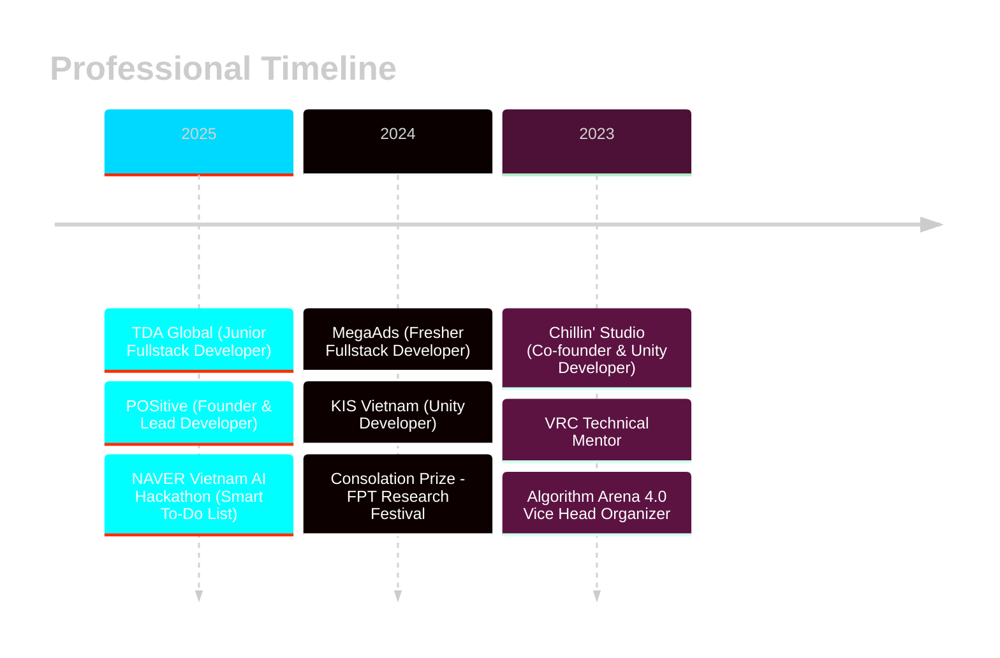

<div align="center">

<!-- Animated Wave Header -->


<!-- Animated Typing SVG -->
<a href="https://git.io/typing-svg"></a>

<!-- Social Badges with Hover Effects -->
<p align="center">
  <a href="https://www.linkedin.com/in/gaslighter/">
    
  </a>
  <a href="mailto:quyennguyen083004@gmail.com">
    
  </a>
  <a href="tel:0335610213">
    
  </a>
  
</p>

<!-- Animated Status -->


</div>

---

<!-- About Me Section with Gradient -->
##  **About Me**

```typescript
const quyenNguyen = {
    location: "Hanoi, Vietnam 🇻🇳",
    education: {
        university: "FPT University",
        major: "Software Engineering",
        status: "Currently Studying"
    },
    currentRole: {
        title: "Junior Fullstack Developer",
        company: "TDA Global",
        period: "Mar 2025 - Sep 2025"
    },
    founder: {
        project: "POSitive",
        description: "Next-gen POS for Vietnamese SMEs",
        backedBy: "FPT University"
    },
    recentAchievement: {
        hackathon: "NAVER Vietnam AI Hackathon",
        project: "Smart To-Do List",
        tech: ["AI", "React", "Laravel", "OpenAI"]
    },
    passions: ["Coding", "AI/ML", "Game Dev", "Innovation"],
    currentlyLearning: ["RAG Systems", "ComfyUI", "Advanced AI"],
    funFact: "I turn coffee into code and ideas into reality ☕️→💻"
};
```

<br clear="right"/>

---

<!-- Tech Stack with 3D Icons -->
##  **Tech Arsenal**

<div align="center">

<!-- Programming Languages -->
### 💻 Languages
<p>
  
  
  
  
  
  
</p>

<!-- Frontend -->
### 🎨 Frontend
<p>
  
  
  
  
  
  
  
</p>

<!-- Backend -->
### ⚙️ Backend
<p>
  
  
  
  
  
</p>

<!-- AI & ML -->
### 🤖 AI & Machine Learning
<p>
  
  
  
  
</p>

<!-- Databases -->
### 🗄️ Databases
<p>
  
  
  
  
  
</p>

<!-- Game Dev & Others -->
### 🎮 Game Dev & Tools
<p>
  
  
  
  
  
  
</p>

</div>

---

<!-- GitHub Stats with Modern Cards -->
##  **GitHub Analytics**

<div align="center">
  
  
</div>

<div align="center">
  
  
</div>

<!-- Trophy Section -->
<div align="center">
  
</div>

---

<!-- Featured Projects -->
##  **Spotlight Projects**

<div align="center">

<!-- Flagship Project - Smart To-Do List -->
### 🌟 **Featured: AI-Powered Smart To-Do List**

<a href="https://web-track-naver-vietnam-ai-hackatho-ecru.vercel.app/">
  
</a>
<a href="https://youtu.be/lcY3--8nCIc">
  
</a>

<br><br>

<table>
<tr>
<td width="60%">

**NAVER Vietnam AI Hackathon - Preliminary Assignment**

An intelligent, **procrastination-aware** task management solution designed specifically for Vietnamese university students. Goes beyond traditional to-do lists by incorporating:

🤖 **AI-Powered Analytics**
- OpenAI GPT-4 integration for task optimization
- Procrastination pattern recognition (0.00-9.99 scoring)
- Behavioral intervention and smart scheduling

⚡ **Advanced Features**
- Pomodoro timer with session tracking
- Real-time notifications via Pusher
- Comprehensive productivity dashboard
- AI chat assistant for productivity advice

📊 **Intelligent Insights**
- Weekly/monthly productivity reports
- Habit analysis & recommendations
- Category performance metrics
- Realistic deadline predictions

</td>
<td width="40%">

**Tech Stack:**

<p align="center">


</p>

**Key Highlights:**
- ✅ AI procrastination detection
- ✅ Real-time WebSocket updates
- ✅ Advanced time tracking
- ✅ Multi-device sync
- ✅ Vietnamese student-centric

</td>
</tr>
</table>

---

<!-- Other Featured Projects -->
<table>
<tr>
<td width="50%">
<h3 align="center">🏪 POSitive</h3>
<div align="center">  
<a href="https://github.com/makecolour/POSitive" target="_blank">

</a>
<br><br>
<p>


</p>
<p><strong>Next-gen POS solution empowering Vietnamese SMEs</strong></p>
<p>✨ Real-time inventory • ⚡ Multi-payment • 📊 Visual reports</p>
</div>
</td>

<td width="50%">
<h3 align="center">📝 Inkspired</h3>
<div align="center">  
<a href="https://github.com/makecolour/Inkspired" target="_blank">

</a>
<br><br>
<p>


</p>
<p><strong>Minimal blogging platform for developers</strong></p>
<p>🚀 Lightweight • 📱 Responsive • 🎨 Beautiful</p>
</div>
</td>
</tr>

<tr>
<td width="50%">
<h3 align="center">☁️ Clowndinary</h3>
<div align="center">
<a href="https://github.com/makecolour/Clowndinary" target="_blank">

</a>
<br><br>
<p>


</p>
<p><strong>Multi-CDN media uploader for TDA Global</strong></p>
<p>📤 Cloudinary • 🐰 Bunny Storage • 🎯 Clean UI</p>
</div>
</td>

<td width="50%">
<h3 align="center">📊 TrustScore</h3>
<div align="center">
<a href="https://github.com/makecolour/TrustScore" target="_blank">

</a>
<br><br>
<p>


</p>
<p><strong>AI-powered trust management system</strong></p>
<p>🧠 Knowledge Graph • 🤖 LLM • 📈 Research-based</p>
</div>
</td>
</tr>

<tr>
<td width="50%">
<h3 align="center">✈️ Voyagenius</h3>
<div align="center">
<a href="https://github.com/makecolour/Voyagenius" target="_blank">

</a>
<br><br>
<p>


</p>
<p><strong>Intelligent travel management solution</strong></p>
<p>🗺️ Trip Planning • 📅 Itinerary • 💼 Smart Booking</p>
</div>
</td>

<td width="50%">
<h3 align="center">📅 Calendros</h3>
<div align="center">
<a href="https://github.com/makecolour/Calendros" target="_blank">

</a>
<br><br>
<p>


</p>
<p><strong>Comprehensive calendar & scheduling app</strong></p>
<p>📆 Event Management • 🔔 Reminders • 👥 Collaboration</p>
</div>
</td>
</tr>
</table>

</div>

---

<!-- Career Timeline -->
##  **Career Journey**



---

<!-- Achievements & Certifications -->
##  **Achievements & Certifications**

<div align="center">

<!-- Awards -->
### 🏆 Awards & Competitions
<table>
<tr>
<td align="center" width="25%">

<br><strong>NAVER Vietnam</strong>
<br>AI Hackathon Participant
<br><sub>2025</sub>
</td>
<td align="center" width="25%">

<br><strong>Runner-up</strong>
<br>Algorithm Arena 6.0
<br><sub>2025</sub>
</td>
<td align="center" width="25%">

<br><strong>Consolation Prize</strong>
<br>FPT Research Festival
<br><sub>2024</sub>
</td>
<td align="center" width="25%">

<br><strong>Consolation Prize</strong>
<br>Coding Inspiration
<br><sub>2023</sub>
</td>
</tr>
</table>

<!-- Certifications -->
### 📜 Certifications
<p>


</p>
<p>


</p>

</div>

---

<!-- Experience Highlights -->
##  **Experience Highlights**

<details open>
<summary><b>🚀 TDA Global - Junior Fullstack Developer</b> <i>(Mar 2025 - Sep 2025)</i></summary>
<br>

```yaml
achievements:
  - Built end-to-end POD product image rendering system
  - Developed TDA Cloud (NAS-based company workspace)
  - Created AI systems using RAG & ComfyUI
  - Launched NFCite (NFC/QR web page builder)
  - Published mobile app: Biểu đồ giá vàng
  
tech_stack: [Laravel, Vue.js, ExpressJS, AI/RAG, ComfyUI]
```
</details>

<details>
<summary><b>🏪 POSitive - Founder & Lead Developer</b> <i>(Apr 2025 - Present)</i></summary>
<br>

```yaml
achievement:
  - Founded POS solution backed by FPT University
  - Architected Vue.js frontend + Laravel backend
  - Built multi-payment system (QR, cash) with e-invoicing
  - Implemented camera-based barcode scanning
  - Created real-time inventory management
  
impact: "Empowering Vietnamese SMEs through digitalization"
tech_stack: [Vue.js, Laravel, PHP, Real-time Systems]
```
</details>

<details>
<summary><b>💻 MegaAds - Fresher Fullstack Developer</b> <i>(Aug 2024 - Jan 2025)</i></summary>
<br>

```yaml
responsibilities:
  - Maintained high-traffic e-commerce platforms (1.6M+ visits)
  - Updated printerval.com, chiaki.vn, vuahanghieu.com
  - Built internal development tools
  
tech_stack: [Laravel, ExpressJS, AngularJS]
```
</details>

<details>
<summary><b>🎮 Game Development Experience</b></summary>
<br>

```yaml
KIS_Vietnam:
  role: "Unity Developer"
  period: "Feb 2024 - Aug 2024"
  projects:
    - name: "Seafood Merge"
      downloads: "1K+"
      platform: "Google Play"

Chillin_Studio:
  role: "Co-founder & Unity Developer"
  period: "May 2023 - Jan 2024"
  projects:
    - name: "Wonder World"
      type: "2D Casual Game"
```
</details>

---

<!-- Activity Graph -->
##  **Contribution Activity**

<div align="center">
  
</div>

---

<!-- Language Stats -->
##  **Language Proficiency**

<div align="center">

| Language | Level | Certificate |
|----------|-------|-------------|
| 🇻🇳 **Vietnamese** | Native | - |
| 🇬🇧 **English** | B2 (CEFR) | IELTS 6.5 |
| 🇯🇵 **Japanese** | Elementary | JPD113 & JPD123 |

</div>

---

<!-- Community -->
##  **Community Impact**

<div align="center">

| Role | Organization | Impact |
|------|--------------|--------|
| 🤖 **Technical Mentor** | Vietnam Robotics Challenge | Mentored students in Arduino & C++ |
| 🎯 **Vice Head Organizer** | Algorithm Arena 4.0 | Organized competitive programming contest |
| 👥 **Volunteer** | VEX Robotics Championship | Ensured smooth competition flow |

</div>

---

<!-- Contact Section with Animation -->
##  **Let's Connect!**

<div align="center">

### 💬 Open for Collaborations & Opportunities

<p>
  <a href="https://www.linkedin.com/in/gaslighter/">
    
  </a>
  <a href="mailto:quyennguyen083004@gmail.com">
    
  </a>
  <a href="tel:0335610213">
    
  </a>
</p>

### 📍 Kien Hung, Hanoi, Vietnam


</div>

---

<div align="center">

### ⚡ **Fun Facts**

```javascript
const dailyRoutine = () => {
    while (alive) {
        eat();
        sleep();
        code();
        buildAIApps();
        repeat();
    }
}
```

**💡 "Code is poetry written in logic, AI is the future written in code"**


---

<p>
  
  
  
</p>

**© 2025 Nguyễn Thượng Quyền | Made with ❤️ and lots of ☕**


</div>
